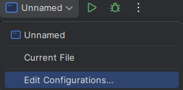
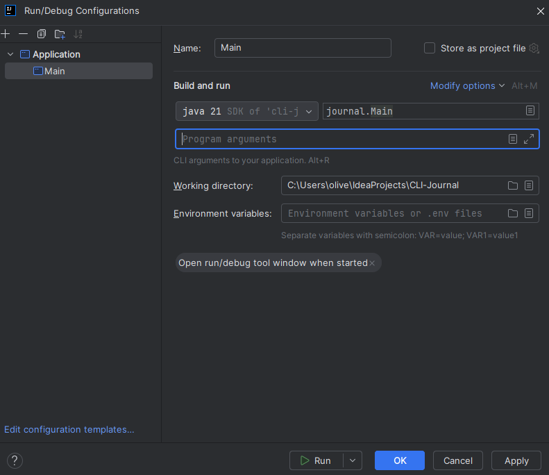

# CLI-Journal

**Note: This is a complete version of the project. Future improvements are outlined below, but the current version is fully functional and polished for demonstration.**

A Command-Line Journal application Written in Java 21.
This tool allows a user to add, search, list and delete personal journal entries stored on a local text file.
All entries are timestamped and assigned a unique ID, to help with searchability and manageability later on.

### Tech Stack

- Language: Java 21
- Build tool: Maven
- Storage: Local .txt file
- IDE: IntelliJ IDEA

### Setup

##### 1. Clone Repository

In terminal paste:

`git clone https://github.com/Culver22/CLI-Journal.git`

`cd CLI-Journal`

##### 2. Compile project

If Maven is installed on a user's machine: 

`mvn clean package`

Or build directly from IntelliJ (Build -> Build Project)

##### 3. Running App

There are 2 ways to run the app:

- **Option 1:**
    
    In the Terminal type:
  `java -cp target\classes journal.Main <argument>`

- **Option 2:**

    If using IntelliJ:
        
    Go to Edit Configurations:

In the box labelled 'program arguments' enter valid arguments.

### Valid Arguments

| Command                   | Usage                                                        | Description                             |
|---------------------------|--------------------------------------------------------------|-----------------------------------------|
| `add`                     | `java -cp target\classes journal.Main add`                   | Add a new journal entry                 |
| `list`                    | `java -cp target\classes journal.Main list`                  | List all entries                        |
| `searchKey <keyword>`     | `java -cp target\classes journal.Main searchKey coffee`      | Search for entries containing a keyword |
| `searchDate <YYYY-MM-DD>` | `java -cp target\classes journal.Main searchDate 2025-10-06` | Search entries by date                  |
| `searchID <id>`           | `java -cp target\classes journal.Main searchID 3`            | Search for a specific entry by ID       |
| `remove <id>`             | `java -cp target\classes journal.Main remove 3`              | Delete an entry by ID                   |

### Future Improvements

If time had willed it I would look to include these further implementations:
- Overwriting existing entries by ID
- Adding password protection/basic encryption
- Add file selection for multiple journals
- Export entries to Markdown or PDF

### Reflection
After coding some larger Python projects, it felt needed to come back and renew my knowledge in Java.
I feel in that sense this project was successful. I redeemed what I had come to know from learning Java last year, 
and even picked up a few new coding techniques such as streams and cases. The project albeit not too complex was a 
useful refresher for the coming year.